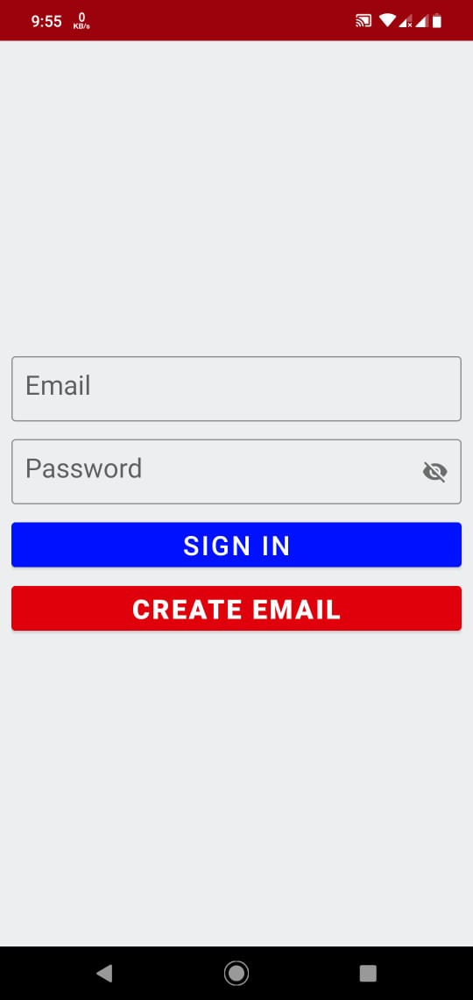
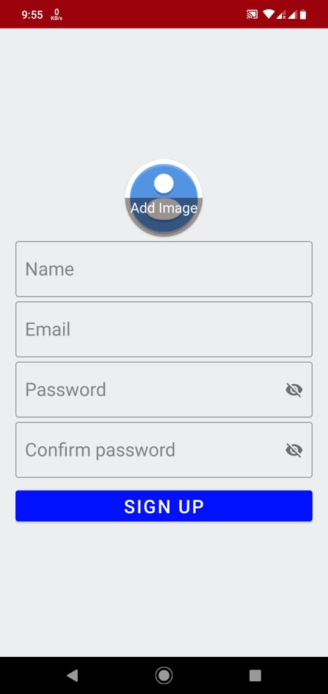
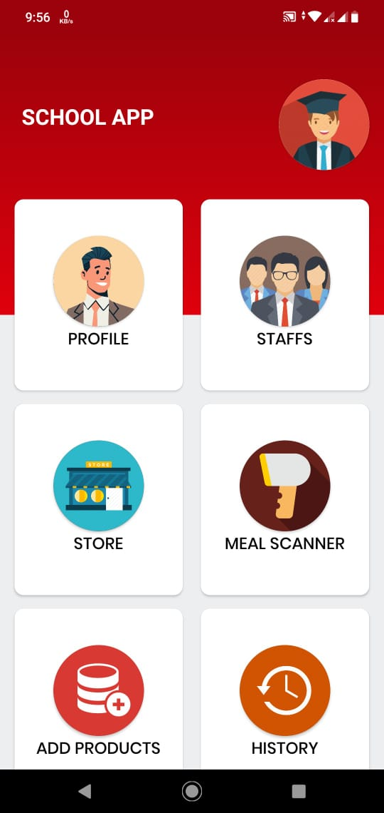
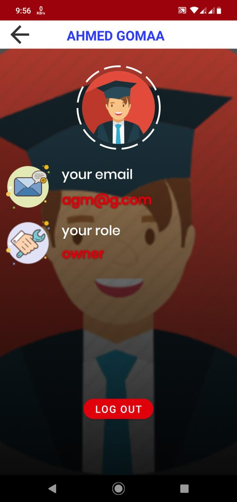
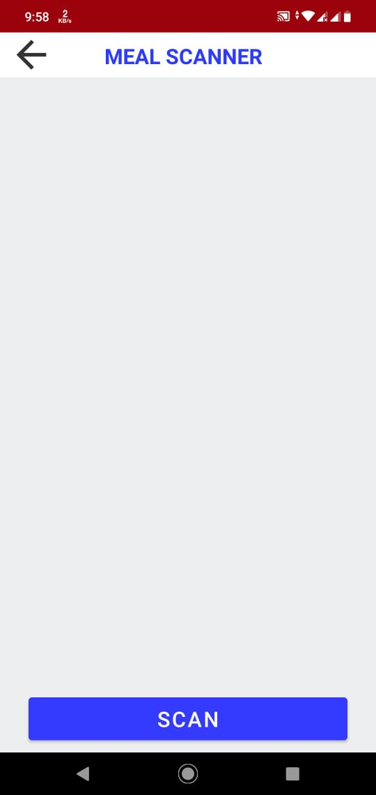
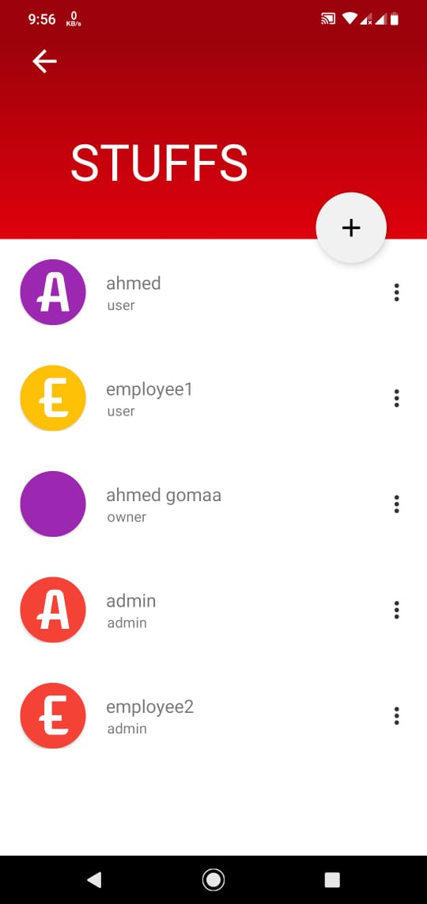
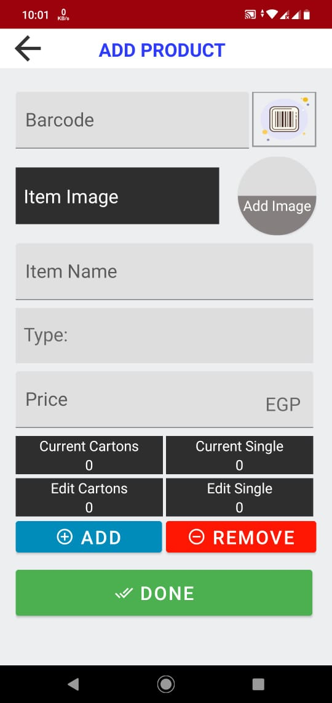
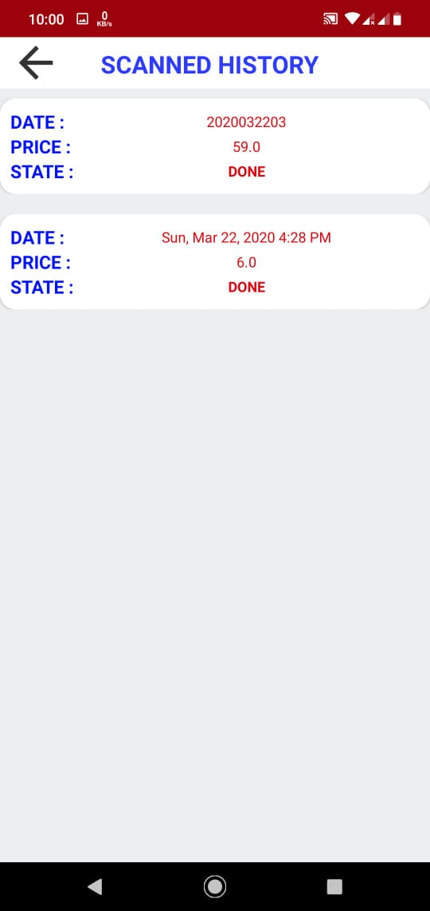

# school-cafeteria-app
it is a school cafeteria management app, it solves the problem of crowding on the school cafeteria at rest, 
and give parents some control over what his sons buy.
this app work with parent app.

#### sign in screen

#### sign up screen

create email with role user untell the school's admin give him role (cashier or store) or the owner for role admin

#### home screen

showing stuff what they can do based on their role in the school

#### profile screen 

it hold the user data like email, name and his role 

#### mealScanner screen 

I called what is in the student shopping bag a meal
in this screen the cashier scan this meal and take meal price and give it to the student

#### stuff screen

This screen appears for school officials to add or remove workers to the school and to communicate with workers

#### enter product screen

this screen appears to the employer with role store for adding product to the app and update the products quantity

#### history screen 

this screen appears to the employer with role cashier and admin to show the scanned meal history

